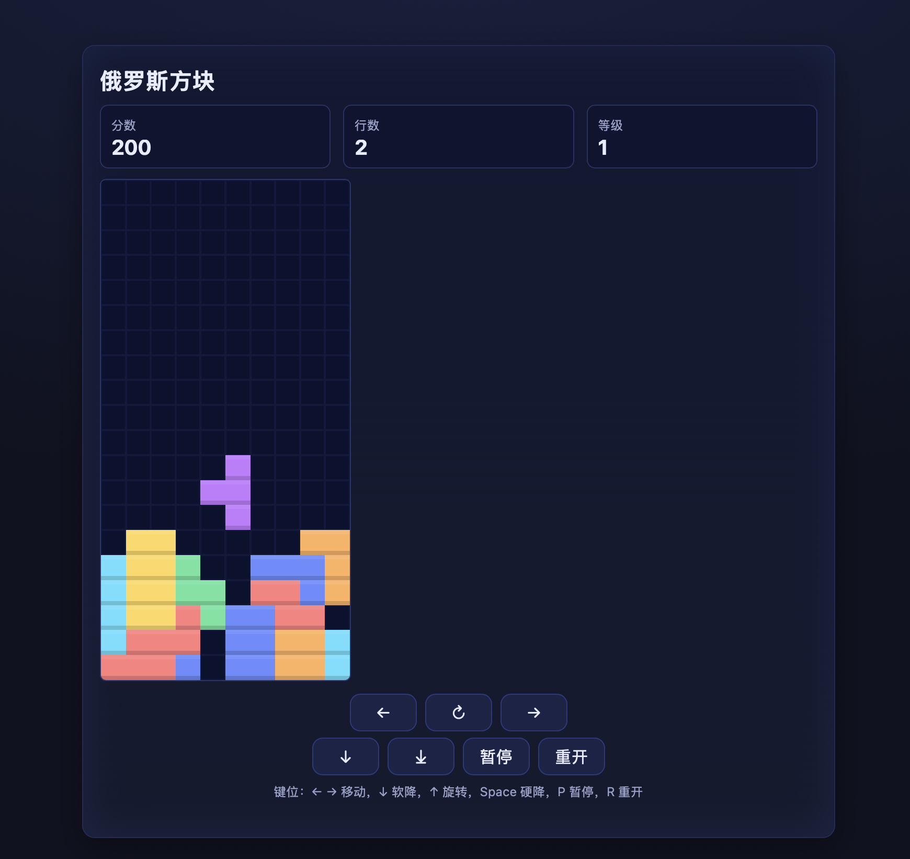

# 俄罗斯方块（网页版）

一个零依赖的纯前端俄罗斯方块游戏。直接双击 `index.html` 用浏览器打开即可游玩。

<https://build-your-own-x-with-ai.github.io/Tetris/>

## 截图

## 运行方式
- 本地双击打开：`index.html`
- 或拖进浏览器窗口即可
- 推荐使用最新版本的 Chrome / Edge / Firefox / Safari

## 操作
- 键盘：
  - `←`/`→` 左右移动
  - `↓` 软降（加速一格）
  - `↑` 旋转
  - `Space` 硬降（直接到底并锁定）
  - `P` 暂停/继续
  - `R` 重新开始
- 触控：
  - 页面下方提供 左/右/旋转/下落/硬降/暂停/重开 按钮

## 规则与计分
- 棋盘大小：10 x 20
- 消行加速：每累计 10 行提升 1 级，方块下落更快（最低 120ms/格）
- 计分（随等级倍增）：
  - 单消：100
  - 双消：300
  - 三消：500
  - 四消（Tetris）：800

## 文件结构
- `index.html`：页面与 UI
- `style.css`：样式（自适应手机/PC）
- `main.js`：核心逻辑与渲染

## 自定义
- 颜色：在 `main.js` 顶部的 `COLORS` 可调整方块配色
- 速度：修改 `main.js` 中的 `dropInterval`（初始 800ms），及升级速度公式
- 画布大小：`index.html` 里的 `<canvas>` 默认 240x480；`style.css` 里按屏幕宽度自适应

## 已知特性
- 简化旋转踢墙（basic wall kick）以便上手
- 生成采用简单随机（非 7-bag），轻量但可能偶尔连发同类

## 授权
- 仅用于个人学习与演示。若需二次开发或分发，请在仓库中注明来源。

祝玩得开心！
 
## 详细设计
- 架构概览：
  - 纯前端三文件：`index.html` 提供结构与按钮；`style.css` 负责自适应与视觉；`main.js` 封装游戏状态、渲染与输入。
  - 无第三方库，直接使用 `<canvas>` 进行栅格绘制，`requestAnimationFrame` 驱动下落与重绘。

- 数据结构：
  - 棋盘网格：`grid: string|null[][]`，大小 `ROWS x COLS`（默认 `20 x 10`），每格存放方块类型字母或 `null`。
  - 当前方块：`current = { type: 'I'|'J'|'L'|'O'|'S'|'T'|'Z', rot: 0..3, x: number, y: number }`。
  - 形状定义：`SHAPES` 为 7 种方块的 4 个旋转状态，每个状态是局部坐标数组，如 `[ [cx,cy], ... ]`。
  - 颜色映射：`COLORS` 为不同类型的颜色。
  - 记分状态：`score`, `lines`, `level`, `dropInterval`, `running`。

- 游戏循环：
  - 入口：初始化网格、`spawn()` 生成首块，绑定输入并调用 `update(0)`。
  - `update(t)`：每帧检查时间戳 `t`，当 `t > nextDrop` 时执行 `softDrop()` 并更新 `nextDrop = t + dropInterval`；每帧均调用 `render()` 重绘。
  - 速度调整：每累计 10 行 `level += 1`，`dropInterval = max(120, 800 - (level-1)*60)`。

- 碰撞与边界：
  - `cells(piece)`：将 `current` 的局部坐标变换为棋盘坐标。
  - `within(x,y)`：判断网格边界（`0 <= x < COLS` 且 `y < ROWS`）。顶部缓冲区 `y < 0` 允许暂时通过。
  - `collide(piece, grid)`：任意单元格越界或与已占用格相撞则返回 `true`。

- 旋转与踢墙：
  - `rotate(dir)`：计算候选旋转状态，并尝试 `[0,-1,1,-2,2]` 的水平偏移以通过简单踢墙（Basic Wall Kick）。
  - 若所有尝试均碰撞则旋转失败，保持原状态。

- 移动与下落：
  - `move(dx)`：水平移动一格，若不碰撞则生效。
  - `softDrop()`：尝试向下移动一格；若碰撞则 `lockPiece()` 锁定落子。
  - `hardDrop()`：循环下落直到下一格会碰撞，随后锁定。

- 锁定与消行：
  - `merge(current)`：将当前方块类型写入 `grid`。
  - `sweepLines()`：自底向上检查完整行，遇到满行则 `splice` 删除并 `unshift` 插入空行，可一次清除多行。

- 计分与等级：
  - 一次清行数量 `cleared`：按 `[0,100,300,500,800]` 计分，乘以当前 `level`。
  - 每满 10 行提升等级并加快下落间隔。

- 渲染与视觉：
  - 背景使用深色格线；`drawCell(x,y,color)` 绘制方块并加入顶部高光与底部阴影强化层次。
  - 当前方块在 `y>=0` 的单元格内绘制，避免顶部缓冲区闪烁。

- 输入与交互：
  - 键盘：监听 `ArrowLeft/Right/Down/Up`、`Space`、`KeyP`、`KeyR`，分别用于移动、旋转、硬降、暂停与重开。
  - 触控：`index.html` 中提供按钮绑定到相同逻辑函数。
  - 暂停：`togglePause()` 切换 `running` 并弹出 toast 提示。

- 代码组织与可扩展点：
  - 可替换随机生成为“7-bag”算法以优化出块分布。
  - 增加“鬼影（Ghost）”与“暂存（Hold）”功能需要额外状态与渲染层。
  - 可引入 SRS 标准旋转踢墙表以提升兼容性。
  - 音效与最高分持久化可通过 `Audio` 与 `localStorage` 实现。

## 关键 API 位置（`main.js`）
- 网格与常量：`COLS/ROWS/TILE`，`COLORS`，`SHAPES`
- 状态初始化：`grid = createGrid(...)`，`spawn()`，`update(0)`，`bindControls()`
- 循环：`update(t)`，落子：`softDrop()`/`hardDrop()`，移动：`move(dx)`，旋转：`rotate(dir)`
- 碰撞/合并/消行：`collide()`，`merge()`，`sweepLines()`
- 计分/等级/界面：`updateHUD()`，`level` 与 `dropInterval`
